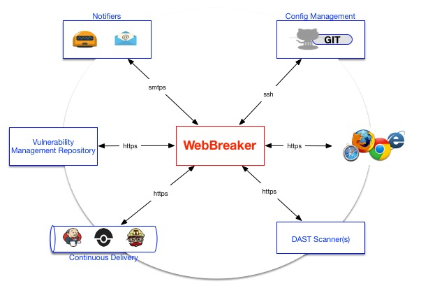

### Introduction ###
Build functional security testing, into your software development and release cycles! WebBreaker provides the capabilities to automate and centrally manage Dynamic Application Security Testing (DAST) as part of your DevOps pipeline.

WebBreaker truly enables all members of the Software Security Development Life-Cycle (SDLC), with access to security testing, greater test coverage with increased visibility by providing Dynamic Application Security Test Orchestration (DASTO).  Current support is limited to the World's most popular commercial DAST product, WebInspect.

### System Architecture ###


### Supported Features ###
* Command-line (CLI) scan administration of WebInspect with Foritfy SSC products.
* [Jenkins](https://jenkins.io) Environmental Variable & String Parameter support (i.e. $BUILD_TAG)
* Docker container v17.x support
* Custom email alerting or notifications for scan launch and completion.
* Extensible event logging for scan administration and results.
* [WebInspect REST API](https://pypi.python.org/pypi/webinspectapi) support for v9.30 and later.
* [Fortify Software Security Center (SSC) REST API](https://pypi.python.org/pypi/fortifyapi) support for v16.10 and later.
* WebInspect scan cluster support between two (2) or greater WebInspect servers/sensors.
* Capabilities for extensible scan telemetry with ELK and Splunk.
* GIT support for centrally managing [WebInspect scan configurations](https://github.com/automationdomination/Webinspect).
* Replaces most functionality of Fortify's `fortifyclient`
* Python compatibility with versions 2.x or 3.x
* Provides AES 128-bit key management for all secrets from the [Fernet encryption](https://pypi.python.org/pypi/cryptography/) Python library.

### Quick Local Installation and Configurations ###
__Installing WebBreaker from source:__
1. ```git clone https://github.com/target/webbreaker```
1. ```pip install -r requirements.txt```
1. ```python setup.py install```

__Configuring WebBreaker:__
1. Turn-on your [WebInspect API Service](https://software.microfocus.com/en-us/software/webinspect).
1. Point _WebBreaker_ to your _WebInspect_ API server(s) by editing:
 [webbreaker/etc/webinspect.ini](https://github.com/target/webbreaker/blob/configuration/webbreaker/etc/webinspect.ini#L4)
1. Point _WebBreaker_ to your _Fortify SSC_ URL by editing:
[webbreaker/etc/fortify.ini](https://github.com/target/webbreaker/blob/master/webbreaker/etc/fortify.ini#L2)
1. SMTP settings on email notifications and a message template can be edited in [webbreaker/etc/email.ini](https://github.com/target/webbreaker/blob/configuration/webbreaker/etc/email.ini#L2)
1. Mutually exclusive remote GIT repos created by users, are encouraged to persist WebInspect [settings](https://github.com/automationdomination/WebInspect/tree/master/settings), [policies](https://github.com/automationdomination/WebInspect/tree/master/policies), and [webmacros](https://github.com/automationdomination/WebInspect/tree/master/webmacros). Simply, add the [GIT URL to the webinspect.ini](https://github.com/target/webbreaker/blob/configuration/webbreaker/etc/webinspect.ini#L33) and their respective directories.

**NOTES:**

* _Required_: As with any Python application that contains library dependencies, [pip](https://pip.pypa.io/en/stable/installing) is required for installation.
* _Optional_: Include your Python site-packages, if they are not already in your $PATH with ```export PATH=$PATH:$PYTHONPATH```.

### Usage ###
WebBreaker is a command-line interface (CLI) client.  See our complete [_WebBreaker Documentation_](https://target.github.io/webbreaker/) for further configuration, usage, and installation.

The CLI supports upper-level and lower-level commands with respective options to enable interaction with Dynamic Application Security Test (DAST) products.  Currently, the two Products supported are WebInspect and Fortfiy (more to come in the future!!)

Below is a Cheatsheet of supported commands to get you started.  

---


    List all WebInspect scans:
    webbreaker webinspect list --server webinspect-1.example.com:8083
    
    Query WebInspect scans:
    webbreaker webinspect list --server webinspect-1.example.com:8083 --scan_name important_site
    
    List with http:
    webbreaker webinspect list --server webinspect-1.example.com:8083 --protocol http

    Download WebInspect scan from server or sensor:
    webbreaker webinspect download --server webinspect-2.example.com:8083 --scan_name important_site_auth
    
    Download WebInspect scan as XML:
    webbreaker webinspect download --server webinspect-2.example.com:8083 --scan_name important_site_auth -x xml
    
    Download WebInspect scan with http (no SSL):
    webbreaker webinspect download --server webinspect-2.example.com:8083 --scan_name important_site_auth --protocol http
    
    Basic WebInspect scan:
    webbreaker webinspect scan --settings important_site_auth
    
    Advanced WebInspect Scan with Scan overrides:
    webbreaker webinspect scan --settings important_site_auth --allowed_hosts example.com --allowed_hosts m.example.com
    
    Scan with local WebInspect settings:
    webbreaker webinspect scan --settings /Users/Matt/Documents/important_site_auth
    
    Initial Fortify SSC listing with authentication (SSC token is managed for 1-day):
    webbreaker fortify list --fortify_user matt --fortify_password abc123
    
    Interactive Listing of all Fortify SSC application versions:
    webbreaker fortify list
    
    List Fortify SSC versions by application (case sensitive):
    webbreaker fortify list --application WEBINSPECT
    
    Upload to Fortify SSC with command-line authentication:
    webbreaker fortify upload --fortify_user $FORT_USER --fortify_password $FORT_PASS --version important_site_auth
    
    Upload to Fortify SSC with interactive authentication & application version configured with fortify.ini:
    webbreaker fortify upload --version important_site_auth --scan_name auth_scan
    
    Upload to Fortify SSC with application/project & version name:
    webbreaker fortify upload --application my_other_app --version important_site_auth --scan_name auth_scan
    
----

### WebBreaker Console Output ###

```
webbreaker webinspect scan --settings MyCustomWebInspectSetting --scan_policy Application --scan_name some_scan_name
 _       __     __    ____                  __            
| |     / /__  / /_  / __ )________  ____ _/ /_____  _____
| | /| / / _ \/ __ \/ __  / ___/ _ \/ __ `/ //_/ _ \/ ___/
| |/ |/ /  __/ /_/ / /_/ / /  /  __/ /_/ / ,< /  __/ /    
|__/|__/\___/_.___/_____/_/   \___/\__,_/_/|_|\___/_/     

Version 1.2.0

JIT Scheduler has selected endpoint https://some.webinspect.server.com:8083.
WebInspect scan launched on https://some.webinspect.server.com:8083 your scan id: ec72be39-a8fa-46b2-ba79-10adb52f8adb !!

Scan results file is available: some_scan_name.fpr
Scan has finished.
Webbreaker complete.
```

### Bugs and Feature Requests

Found something that doesn't seem right or have a feature request? [Please open a new issue](https://github.com/target/webbreaker/issues/new/).

### Copyright and License

* Copyright 2017 Target Brands, Inc.
* [Licensed under MIT](LICENSE.txt).
